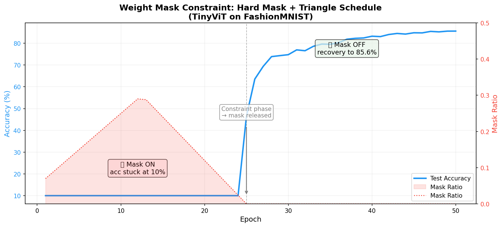
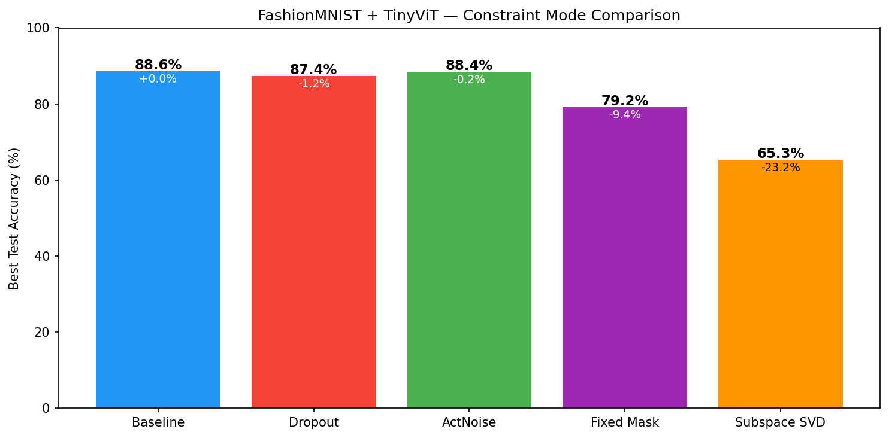
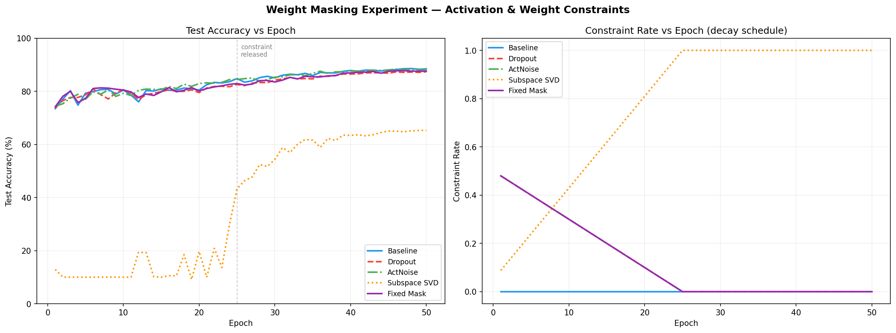
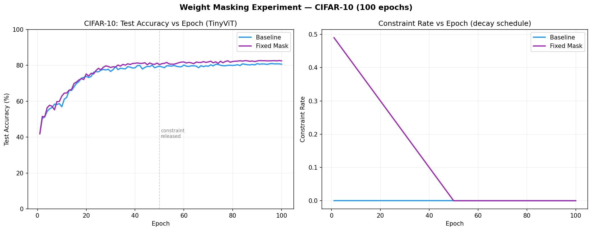
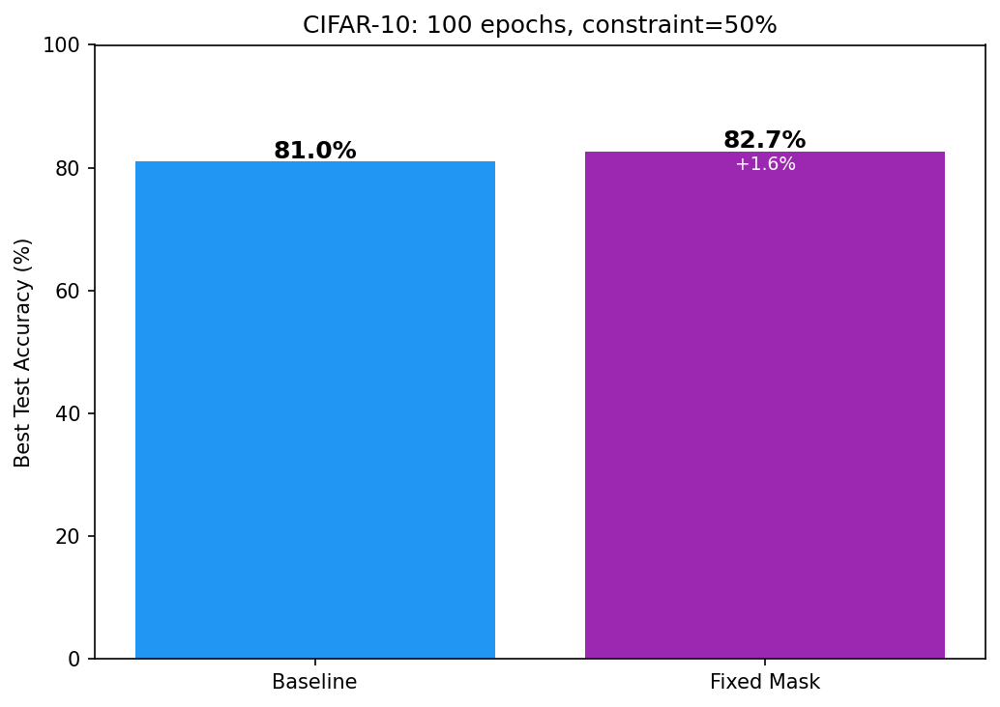

# Weight Masking Experiment

> 把人类从婴儿到成人的「机能不全→健全」过程，抽象为一种模型训练策略。

## 实验构想

这个idea其实是因为晚上躺在床上瞎想想到的，跟群里的大佬讨论之后便想着来验证一下是否可行。

其实我认为这个trick更应该放在具身智能的模型来学习，而不是大语言模型和图像识别这种，因为LLM和CV的输出维度太高了，在信息论上很难保证理论成立，但是我一个破211本科生也没法去实验具身智能的东西，只能先做一个评估。

## 实验日志

### 2026年7月21日

#### 思路尝试

尝试直接对模型权重的一部分值进行手动归平。

#### 实验设计

##### 模型

- **TinyViT**（~270万参数，6层 Transformer，patch=4）
- 训练集：FashionMNIST（6万张）

##### 约束策略

| 模式                   | 做法               | 类比           |
| ---------------------- | ------------------ | -------------- |
| **Baseline**           | 正常训练，无约束   | 正常发育       |
| **Hard Mask** (已弃用) | 训练中随机清零权重 | 神经连接断裂 ❌ |

##### 调度策略 (Schedule)

| 名称         | 行为                               |
| ------------ | ---------------------------------- |
| **decay**    | 最大强度 → 线性衰减到 0            |
| **triangle** | 小强度 → 升到最大 → 降回 0         |
| **step**     | 前 N 个 epoch 固定强度，之后全放开 |

##### 初步结果（权重 Mask 方案）

- **Mask 期（epoch 1-24）：test acc 卡在 10%**——权重清零让梯度无法积累，模型学不动
- **放开后（epoch 25+）：火箭起飞**，从 46% 追到 85.6%，但没追上 baseline（91%）
- **结论：权重层面操作对 Transformer 太暴力**，应改为激活值层面的约束（dropout / 噪声），或者考虑是否存在代数方法将屏蔽的权重短路。（2026年7月22日 17:54:06更正，代码存在逻辑问题，权重层面操作并无问题）

### 2026年7月22日

#### 激活值约束实验

将约束从权重层移到激活层，类比「感官/处理不成熟→逐渐健全」。

##### 模型

- **TinyViT**（~270万参数，6层 Transformer，patch=4）
- 训练集：FashionMNIST（6万张）
- Seed=42, Epochs=50, Constraint Epochs=25, Schedule=decay, AMP

##### 新增约束模式

| 模式               | 层级   | 做法                                         | 类比                 |
| ------------------ | ------ | -------------------------------------------- | -------------------- |
| **Dropout**        | 激活层 | 前向随机丢弃神经元激活，约束期衰减到 0       | 感官处理不成熟       |
| **ActNoise**       | 激活层 | 激活值加高斯噪声（std≈rate×0.3），约束期衰减 | 神经系统噪音         |
| **Fixed Mask** 🆕   | 权重层 | 约束期开始时选定固定权重子集 mask，全程不变  | 固定神经连接缺失     |
| **Subspace SVD** 🆕 | 权重层 | 每 epoch SVD 截断到低秩，逐 epoch 放开       | 数学短路（低维发育） |

##### 实验结果

| 模式             | Best Test Acc | vs Baseline | 结论                                                   |
| ---------------- | ------------- | ----------- | ------------------------------------------------------ |
| **Baseline**     | 88.59%        | —           | 正常发育，基线                                         |
| **Dropout**      | 87.39%        | -1.2%       | ✅ 几乎无损，模型对激活层扰动非常鲁棒                   |
| **ActNoise**     | 88.40%        | -0.2%       | ✅ 不仅没伤害，甚至有轻微正则化效果                     |
| **Fixed Mask**   | 87.79%        | -0.8%       | ✅ 差距很小，直觉在更大的数据集上也许会更有效果，待验证 |
| **Subspace SVD** | 65.35%        | -23.2%      | ❌ 数值崩塌，test loss 飙到 64，勉强爬回                |

##### 结论

1. **激活层约束几乎不影响最终性能**——Transformer 对 dropout/噪声的鲁棒性远超预期
2. **Fixed Mask 修复后接近 baseline**——修复了梯度-权重错位 bug 后，固定 mask 从 79% 跳到 87.79%
3. **权重层约束（SVD 截断）仍是硬伤**——低秩截断在 ViT 上造成数值不稳定，需要重新设计（warmup、部分层施加、更慢的 rank 增长）
4. **Fixed Mask >> 随机 Mask**——固定 mask 子集让被保留的权重能稳定积累梯度，验证了「固定机能不全」优于「每次随机重新受伤」
5. 思考应该尝试更大的数据集，FashionMNIST数据过于简单难以体现trick价值

#### Fixed Mask在CIFAR10数据集上的实验

##### 训练原型

**数据集：** CIFAR-10（彩色 32×32，5 万训练图，10 类）
**模型：** TinyViT（270 万参数，6 层 Transformer）
**训练：** 100 epoch，AMP 混合精度

##### 实验细节

**Fixed Mask 约束逻辑：**

- 训练开始前用 `seed=42` 固定生成一个 50% 零的二进制 mask（每个权重矩阵有自己固定的 mask）
- **epoch 1 到 50（约束期）：** `weight = weight * mask` in-place，mask 比例从 50% 按 decay 衰减到 0%
- **epoch 51 到 100（放开期）：** 不再 mask，所有权重正常训练
- 被 mask 的位置在前向时为 0 → 梯度为 0 → AdamW 不更新 → 解锁后从零开始学

**Baseline 对照：** 同样的参数，但没有 mask 操作，从头到尾正常训练

**数据增强：** RandomCrop + RandomHorizontalFlip + Normalize（CIFAR-10 标准流程）

##### 实验结果

**区别上一次实验（FashionMNIST）：**

| 项目       | FashionMNIST     | CIFAR-10             |
| ---------- | ---------------- | -------------------- |
| 图像       | 单通道灰度 28×28 | 三通道彩色 32×32     |
| 训练集     | 6 万张           | 5 万张               |
| 难度       | 简单             | 难                   |
| Epoch      | 50（25+25）      | 100（50+50）         |
| Baseline   | 88.59%           | 81.04%               |
| Fixed Mask | 87.79%（-0.8%）  | **82.69%（+1.65%）** |

##### 结论

1. 实验设计思路基本正确，与朴素训练方式相比在更为复杂的数据集上表现优秀
2. （推测）此训练方式在输出维度较小时会表现优秀，此训练方式并不适用于GPT等语言输出模型（从信息论的角度理解），但是输入维度应该越大越好增大
3. （推测）我实际感觉这个trick更适合放在具身智能方面，但是我目前实在没有这个能力与资源。
